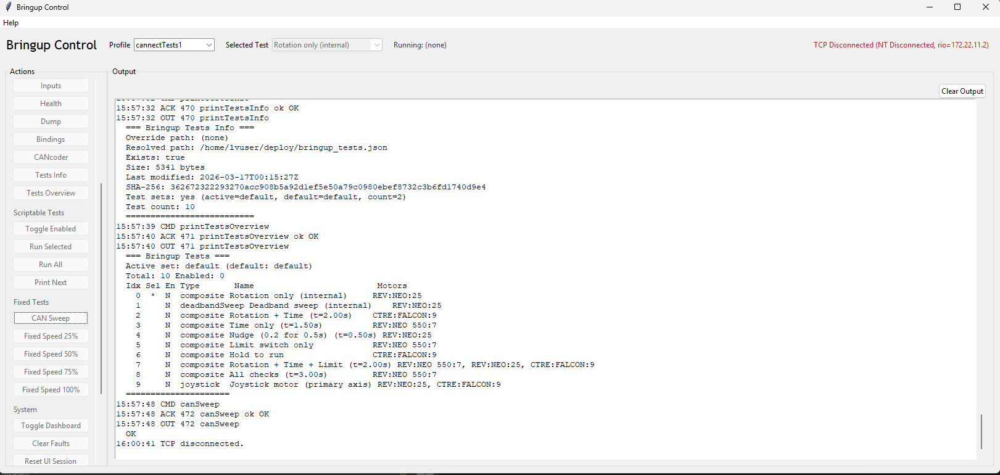

# Swerve Bringup Diagnostics System

Purpose: Rapid, evidence-based bringup and CAN diagnostics for FRC swerve and other CAN devices.

This repo is one system with two cooperating parts:
- Robot-side WPILib Java bringup harness that actively runs motors and sensors on the roboRIO.
- PC-side Python tool that passively listens to the robot CAN bus via CANable (slcan over COM) and publishes diagnostics to NetworkTables.

## Why This Exists
Purpose: Make hardware issues obvious before you waste time on tuning or code bugs.

Highlights:
- Dual-source diagnostics that keep local roboRIO data separate from CAN-bus observations.
- Safe bringup controls with explicit stop-latch rules and Driver Station priority.
- Report runner that throttles console output to protect the 20ms control loop.
- PCAP/PCAPNG capture + Wireshark dissector for wire-level evidence.
- JSON reports and AI-assisted triage (`bringup_report.json` + `docs/AI_DIAGNOSIS.md`).
- Data-driven hardware profiles shared by robot code and the PC tool.
- Reverse-engineering inventory tooling for CAN traffic classification (additive).

## Feature Matrix
Purpose: Show the high-value capabilities at a glance.

| Capability | Robot (Java) | PC Tool (Python) |
| :-- | :--: | :--: |
| Motor bringup and actuator control | Yes | No |
| Local device health (faults/current/temp) | Yes | No |
| CAN visibility (seen/missing/age/fps) | No | Yes |
| NetworkTables diagnostics publishing | Reads | Writes |
| TCP console parsing (warnings/errors) | Produces | Parses |
| PCAP/PCAPNG capture + Wireshark | No | Yes |
| bringup_report.json snapshot | Yes | No |
| Reverse-engineering inventory output | No | Yes |

## What It Gives You
Purpose: Fast, repeatable visibility into device health and CAN behavior.

- Controlled motor bringup (add one or all, known inputs).
- Local health checks (bus voltage, current, temperature, faults, last error).
- CAN-bus visibility (seen/missing, age, msgCount, fps).
- TCP console parsing for warnings and errors from the roboRIO.
- Device presence confidence and best-effort LED/CAN suspicion inference.

## What It Does Not Do
Purpose: Avoid confusion about scope.

- Fix robot logic or tuning problems.
- Replace vendor tools (REV Hardware Client, CTRE Tuner X).
- Transmit CAN frames from the PC tool (read-only by design).

## Quick Start
Purpose: Get a first bringup run in minutes.

Robot-side (roboRIO):
- Open in WPILib VS Code and deploy as normal.
- Connect an Xbox controller.
- Press `Start` to add all configured devices.
- Press `D-pad Left` for local health.
- Press `D-pad Up` for the CAN Diagnostics Report.
- Press `X` to dump `bringup_report.json`.

PC-side (Driver Station Windows PC):
- Install dependencies:
```cmd
py -m pip install --upgrade python-can pyserial pynetworktables pyntcore
```
- Run the CAN bridge:
```cmd
python tools\can_nt\can_nt_bridge.py --profile demo_home_022326 --interface slcan --channel COM3 --bitrate 1000000 --rio 172.22.11.2 --publish-can-summary
```

**Pit Flow (2-Minute Checklist)**
Purpose: Rapid triage before deeper debugging.

1. Enable the robot in teleop.
2. Press `Start` to add all configured devices.
3. Press `D-pad Left` and resolve any local faults or warnings.
4. Press `D-pad Up` and resolve bus errors or high utilization first.
5. If the PC tool is running, press `D-pad Down` and confirm devices are seen.
6. Press `X` to dump `bringup_report.json` and use `docs/AI_DIAGNOSIS.md`.

## Core Workflow
Purpose: A short, repeatable sequence for pit debugging.

1. Check local health (`D-pad Left`). Fix faults and warnings first.
2. Check CAN report (`D-pad Up`). Fix bus errors before touching devices.
3. Check CAN visibility (`D-pad Down`) if the PC tool is running.
4. Dump `bringup_report.json` (`X`) and use `docs/AI_DIAGNOSIS.md`.
5. Only then debug behavior and tuning.

## Safety Model (Client/Server)
Purpose: Keep actuation deterministic and safe.

- The robot is the server and owns actuation authority.
- PC tools are clients; Xbox is a local client with highest priority.
- Xbox always wins on conflicts.
- Stop/disable/abort sets a stop latch.
- Stop latch can be set by TCP or Xbox; only Xbox clears it.
- When stop latch is set, TCP start/enable/run commands are rejected.
- TCP loss or Xbox disconnect triggers a safe stop and sets the latch.
- Driver Station enable/disable/E-stop overrides all client commands.
- NetworkTables is diagnostics/state only; TCP is command/log output only.

## Real-Time Printing Model
Purpose: Prevent console output from breaking the 20ms control loop.

- WPILib runs a 20ms periodic loop.
- Console printing is slow and blocking.
- All report output uses a shared report runner:
- Reports are queued and printed incrementally across cycles.
- Batch size and chunk size are limited per cycle.

## Hardware Profiles (Data-Driven)
Purpose: Keep configuration easy to edit without code changes.

- Source of truth: `data/bringup_system.json`.
- Deploy copy: `src/main/deploy/bringup_system.json`.
- Sync tool: `python tools/sync_profiles.py`.
- GUI editor: `tools/can_topology/can_top_editor.py`.
- Profiles apply in file order; press `Back` to rotate.
- Runtime override: `--bringup-profile=<name>`.

## CAN Bridge (PC Tool)
Purpose: Passive CAN sniffing and diagnostics on Windows.

- Hardware: CANable Pro V2 (slcan firmware by default).
- Read-only by design. Never transmits CAN frames.
- Publishes diagnostics to NetworkTables under `bringup/diag/...`.
- Optional PCAP/PCAPNG capture and named pipe for Wireshark.
- Windows is the primary host; default workflows use slcan over a COM port.

Useful flags:
- `--print-publish` for seen/missing transitions.
- `--print-summary-period N` for periodic summaries.
- `--publish-unknown` to surface unknown devices.
- `--pcap <path>` to capture PCAPNG.
- `--list-ports` to enumerate COM ports.

## Bringup Control UI
Purpose: Fast command access and readable console output from the roboRIO.

Screenshot:


Annotated example (shortened):
```text
15:57:32 CMD printTestsInfo      -> UI command sent
15:57:32 ACK 470 printTestsInfo  -> Robot accepted command
15:57:32 OUT 470 printTestsInfo  -> Robot output begins
=== Bringup Tests Info ===
Resolved path: /home/lvuser/deploy/bringup_tests.json
Test count: 10
==========================
```

## Bringup Tests
Purpose: Manual, data-driven tests for motors and encoders.

- File: `src/main/deploy/bringup_tests.json`.
- Test sets selected via `default_test_set`.
- Runtime override: `--bringup-tests=...`.
- Wizards: `tools/bringup_test_wizard/run_bringup_test_wizard.bat` and `tools/test_template_wizard/run_test_template_wizard.bat`.

## Documentation Index
Purpose: Find deep details without cluttering the README.

- `docs/ARCHITECTURE.md`
- `docs/SETUP.md`
- `docs/USER_GUIDE.md`
- `docs/OPERATOR_SURFACES.md`
- `docs/TESTING.md`
- `docs/AI_DIAGNOSIS.md`
- `docs/CAN_BACKGROUND.md`
- `tools/can_nt/README_CAN_NT.md`

## Notes
Purpose: Point to intent and planning.

- `notes/planning/PROJECT_INTENT.md`
