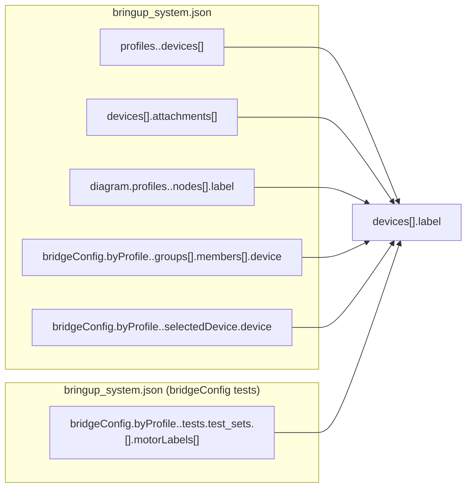

# Bringup Label Link Map

Purpose: Visualize where device labels are used as references across bringup structures.

Notes:
- All label references must match exactly one entry in `devices[].label`.
- Labels are globally unique within the devices table.
- Diagram nodes are label-linked only when the node represents a real device.
