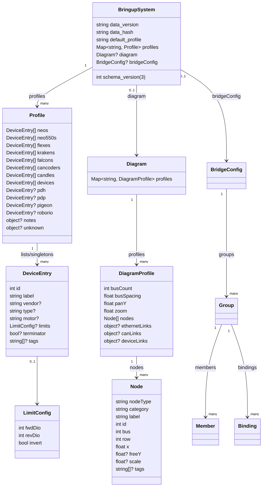

# Bringup System Schema Diagram

Purpose: Visualize the structure of `data/bringup_system.json` without showing live data.

Notes:
- `schema_version`, `data_version`, and `data_hash` are required at the root (schema_version=3).
- `devices` entries require `vendor` and `type`.
- `diagram` is editor-only and ignored by robot/PC tools.
- `bridgeConfig` is optional and ignored by the topology editor.
    class BridgeConfig {
        int schemaVersion
        string? generatedAt
        Group[] groups
        object selectedDevice
    }

    class Group {
        string name
        bool enabled
        Member[] members
        Binding[] bindings
    }

    class Member {
        string device
        bool enabled
    }

    class Binding {
        string input
        string kind
        float? value
    }
