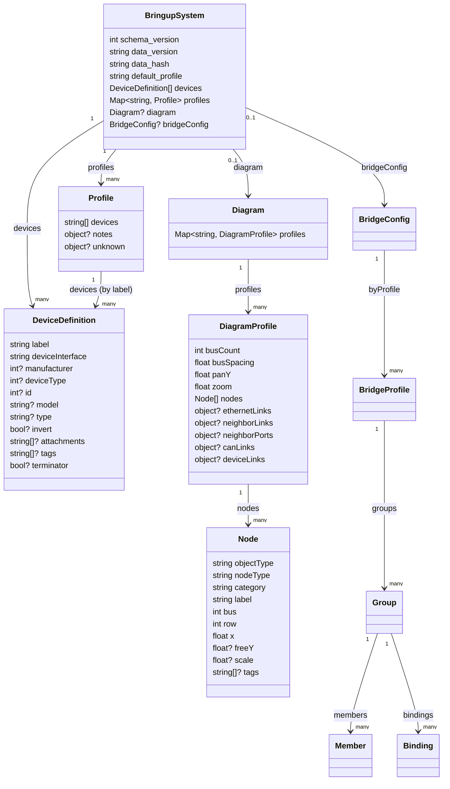
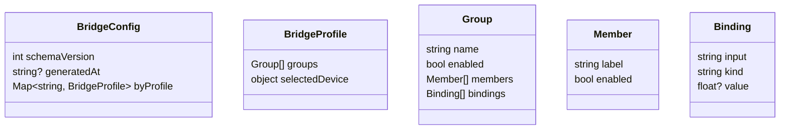

# Bringup System Schema Diagram

Purpose: Visualize the structure of `data/bringup_system.json` without showing live data.

Notes:
- `schema_version`, `data_version`, and `data_hash` are required at the root (schema_version=5).
- `devices` is the central devices table; labels must be unique.
- `devices[].id` is the single interface-local identifier field for CAN, DIO, USB, and other device interfaces.
- Profiles list device labels only under `profiles.<name>.devices`.
- Limit switches are DIO devices with `type=limitSwitch` and are referenced by label in `attachments` on the CAN device.
- Diagram/topology nodes use `objectType` as the canonical shared kind field. `nodeType` is still written as a mirrored compatibility field.
- Diagram `objectType=device` entries resolve to device records by `label` and do not store a separate hardware id.
- Bridge group members are stored by shared object `label` and may reference device or infrastructure objects.
- `diagram` is editor-only and ignored by robot/PC tools.
- `bridgeConfig` is optional; the topology editor can read/write it for per-profile group overlays.
- Robot and PC tools ignore bridgeConfig for control logic (CLI/UI only).

