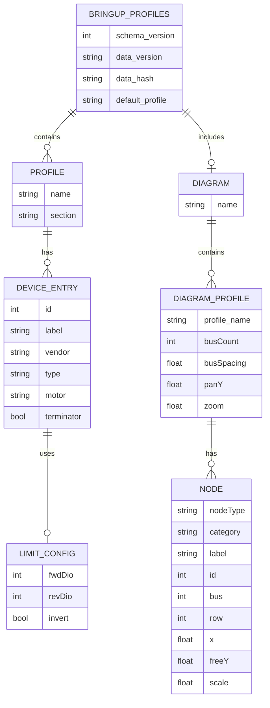

# Bringup Profiles ER Diagram

Purpose: Show a database-style ERD view of the bringup profiles JSON structure.

Notes:
- This ERD is a conceptual mapping of JSON objects to relational entities.
- `PROFILE.section` represents which list a device came from (e.g., `neos`, `krakens`, `devices`, `pdh`).
- Optional JSON fields are shown without nullable markers to keep the ERD compact.
