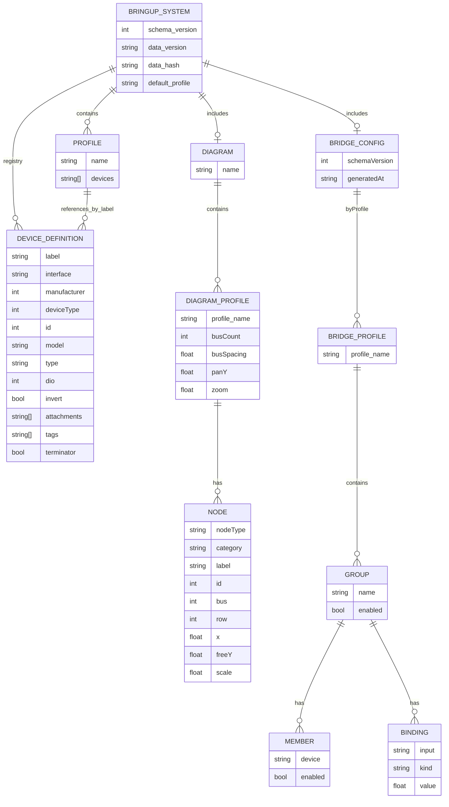

# Bringup System ER Diagram

Purpose: Show a database-style ERD view of the bringup profiles JSON structure.

Notes:
- This ERD is a conceptual mapping of JSON objects to relational entities.
- Root schema_version is 4.
- Profiles only store device labels; identity fields live in the device registry.
- Optional JSON fields are shown without nullable markers to keep the ERD compact.
