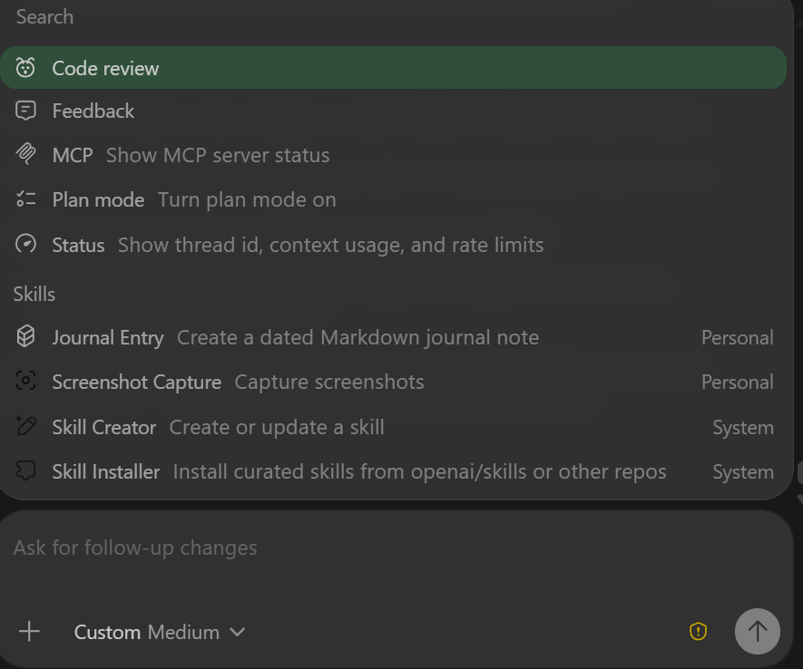

# Journal Entry - 2026-04-22
Date: 2026-04-22 11:14:45

How to get started with agent skills in codex youtube video. Part of my motivation for this project was learning how to use AI in making projects like this. Hopefully this video has some info to imrove the codex coding environment.

- skills
- / in prompt brings up a search 

## Update - 2026-04-22 11:27:21

- $ brings up a skills menu?
- skills can be in your repo or in your global .codex
- I downloaded some skills from ??? and installed a few in vscode/codex
-  $changelog-generator - use this skill to create and append to a changelog in the root of the project
-  $create-plan - 

Example:
$create-plan review CLI command structure for consistency and ease of use
