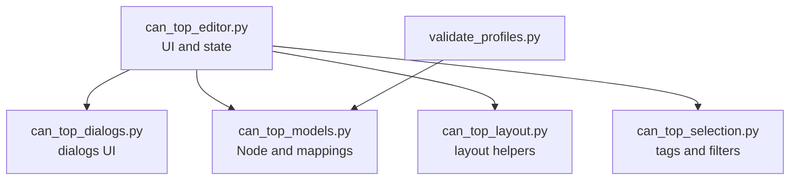

# CAN Topology Editor Architecture

## Purpose
Describe the topology editor architecture, data flow, and contracts.

## Scope
Purpose: Define what this document covers and does not cover.
- Covers the CAN topology editor under `tools/can_topology/`.
- Focuses on UI, data model, persistence, and layout actions.
- Does not cover robot or PC CAN tooling behavior.

## Context
Purpose: Explain where the editor fits in the system.
- The editor produces `bringup_system.json` and diagram metadata.
- The profiles are consumed by robot code and the PC tool.
- Diagram metadata is editor-only and ignored by robot/PC tools.
- bridgeConfig.byProfile groups are used by CLI and can be rendered in the PC UI live view.

## Components
Purpose: Describe major modules and responsibilities.
- `can_top_editor.py`: UI controller, menu wiring, and editor state.
- `can_top_models.py`: Node model, categories, and mappings.
- `can_top_dialogs.py`: Node and callout dialogs.
- `can_top_layout.py`: stateless layout helpers (tidy, reset, align, distribute, snap).
- `can_top_selection.py`: tag normalization, tag filters, and list sorting helpers.
- `validate_profiles.py`: Standalone profile validator.
- Future modules (planned):
  - `can_top_persistence.py`: profile + diagram read/write.
  - `can_top_actions.py`: bulk edit and tag actions.

## Call Hierarchy
Purpose: Show the primary caller-callee flow for the topology editor.


```mermaid
flowchart TD
    editor["can_top_editor.py<br/>UI and state"]
    dialogs["can_top_dialogs.py<br/>dialogs UI"]
    models["can_top_models.py<br/>Node and mappings"]
    layout["can_top_layout.py<br/>layout helpers"]
    selection["can_top_selection.py<br/>tags and filters"]
    validate["validate_profiles.py"]

    editor --> dialogs
    editor --> models
    editor --> layout
    editor --> selection
    validate --> models
```


## Data Model
Purpose: Define the core node representation.
- `Node` represents both devices and callouts.
- Devices are `node_type = "device"`.
- Callouts are `node_type = "callout"` and reference a node or bus.
- Tags are freeform strings stored per node.

## Persistence
Purpose: Define the JSON structures written by the editor.

### bringup_system.json
Purpose: Stable device configuration consumed by robot and PC tools.
- Canonical location: `data/bringup_system.json`.
- RoboRIO deploy copy: `src/main/deploy/bringup_system.json` (synced from `data/`).
- Root fields:
- `schema_version` (int, 4)
- `data_version` (string)
- `data_hash` (string)
- `default_profile` (string)
- `devices` (device registry)
- `profiles` (object of named profiles)
- Optional `diagram` (editor-only layout metadata)
- Optional `bridgeConfig` (per-profile groups/bindings metadata)

Profile sections:
- `profiles.<name>.devices` is a label-only list referencing the device registry.

Device entry schema:
- Required: `label`, `interface`
- CAN devices require: `manufacturer`, `deviceType`, `id`
- Optional: `model`, `terminator`, `tags`, `limits`, `attachments`

Example:
```json
{
  "label": "FL KRAK",
  "interface": "CAN",
  "manufacturer": 4,
  "deviceType": 2,
  "id": 2,
  "model": "KRAKEN",
  "limits": { "switches": [{ "label": "FL LIMIT", "dio": 0, "invert": false }] },
  "terminator": false,
  "tags": ["swerve", "front-left"]
}
```

### Diagram Metadata
Purpose: Persist editor layout and callouts.
- Stored under `diagram.profiles.<profileName>`.
- Includes `busOffsets`, `busLefts`, `busRights`, `panY`, `zoom`.
- Includes `nodes` list for devices and callouts (position, scale, tags).
- Optional: `neighborLinks` (undirected adjacency between node keys).
- Optional: `neighborPorts` (directed port adjacency, preferred for inference).
- Optional: `deviceLinks` (CANnect port links; used to derive `next/branch1/branch2` neighborPorts).

Example:
```json
{
  "busCount": 2,
  "busSpacing": 160.0,
  "nodes": [
    { "nodeType": "device", "category": "krakens", "label": "FL KRAK", "id": 2, "bus": 0, "row": 0, "x": 220.0, "tags": ["swerve"] },
    { "nodeType": "callout", "text": "intake segment", "targetType": "bus", "targetBus": 0, "x": 120.0, "tags": ["intake"] }
  ]
}
```

## Key Behaviors
Purpose: Describe editor behavior at a high level.
- Layout actions adjust node x positions and preserve bus assignments unless explicitly reset.
- Tidy actions align columns across buses or within selection.
- Reset layout spreads nodes per bus segment without reassignment.
- Tags enable selection, filtering, sorting, and tidy-by-tag actions.

## UI Concepts
Purpose: Capture UI structure.
- Left panel: node list with tags and filter state.
- Right panel: canvas with buses, nodes, and callouts.
- Details panel: selected node details including tags.
- Menus: File, Edit, Tags, Layout, View, Help.

## Contracts
Purpose: Declare stable API contracts.
- `bringup_system.json` is the single source of truth; deploy copies must be synced from `data/`.
- Diagram metadata is editor-only and must not be consumed by robot/PC tools.
- Tags are optional and must not break existing tools when absent.

## Tradeoffs
Purpose: Document key architectural tradeoffs.
- Tkinter keeps dependencies minimal but limits richer UI widgets.
- Storing diagram metadata inside `bringup_system.json` simplifies user workflow.
- Shared profile JSON means editor must be conservative about schema changes.

## Future Extensions
Purpose: Capture safe follow-on improvements.
- Add tag-based color themes or grouped layouts.
- Add import/export of tag sets.
- Add profile diff and merge support.
- Add a layout preview or history panel.
